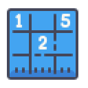
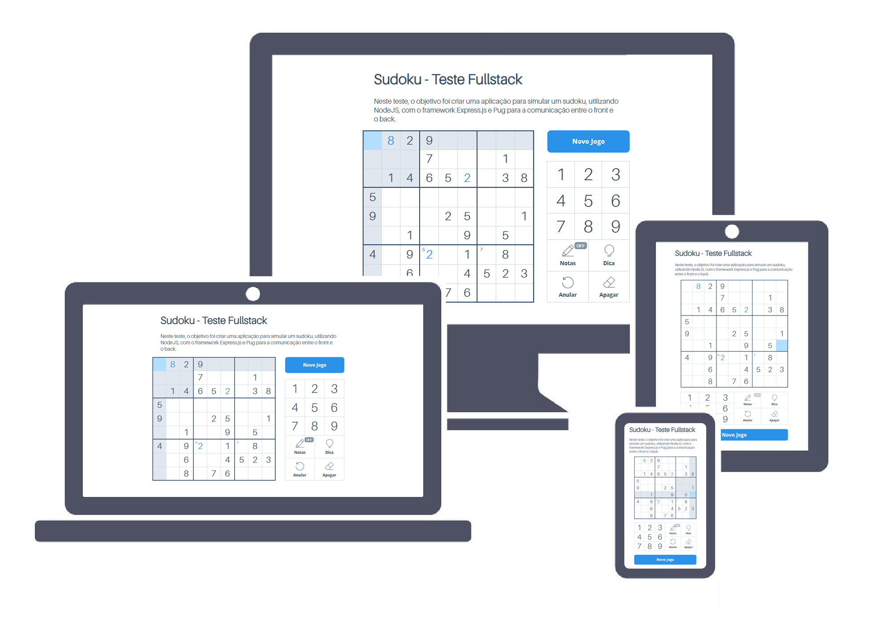

<h1 align="center">
    </img>
    <br/>Sudoku
</h1>
<p align="center">Teste técnico <strong>Full Stack</strong> para feedback.</p>

<p align="center">
  <a aria-label="Versão do Node" href="https://github.com/nodejs/node/blob/master/doc/changelogs/CHANGELOG_V12.md#12.18.4">
    </img>
  </a>
  <a aria-label="Versão do Express.js" href="https://expressjs.com/en/changelog/4x.html#4.17.1">
    </img>
  </a>
  <a aria-label="Versão do Sass" href="https://www.npmjs.com/package/node-sass/v/5.0.0">
    </img>
  </a>
  <a aria-label="Build Status" href="https://travis-ci.org/MateusAquino/sudoku">
    </img>
  </a>
  <a aria-label="Desafios" href="#-desafios">
  	</img>
  </a>
</p>

## 🚀 Instalação
A porta padrão é **3000**. Ao iniciar seu projeto localmente, acesse `localhost:3000`.  
Clone o projeto em seu computador e em seguida configure um cluster no MongoDB, coloque a **string de conexão** em um arquivo `.env` com o nome `databaseuri`.    
Por fim, para instalar as dependências e executar o Servidor (backend) separadamente, utilize os comandos abaixo:
```bash
yarn install
yarn runb
```

Para compilar e executar o Website (frontend) separadamente:
```bash
yarn install # caso ainda não tenha utilizado
yarn build
yarn runf
```

Para compilar e executar **ambos** os apps (backend e frontend):
```bash
yarn install
yarn build
yarn start
```

## 💻 Preview
<h1 align="center">
    </img>
</h1>
<p>O live-preview deste app pode ser encontrado clicando <a aria-label="Live Preview" href="https://feedback-sudoku.herokuapp.com/">aqui</a>.</p>

## 🏆 Desafios
- [x] Botão de Anular
- [x] Botão de Notas (desafio pessoal)
- [x] Botão de Dica (desafio pessoal)
- [x] Continuar jogo em outros dispositivos (desafio pessoal)

## 📜 Licença

[MIT](./LICENSE) &copy; [Mateus Aquino](https://www.linkedin.com/in/mateusaquino/)
