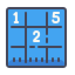

<h1 align="center">
    </img>
    <br/>Sudoku
</h1>
<p align="center">Teste técnico <strong>Full Stack</strong> para feedback.</p>

<p align="center">
  <a aria-label="Versão do Node" href="https://github.com/nodejs/node/blob/master/doc/changelogs/CHANGELOG_V12.md#12.18.4">
    </img>
  </a>
  <a aria-label="Versão do Express.js" href="https://expressjs.com/en/changelog/4x.html#4.17.1">
    </img>
  </a>
  <a aria-label="Versão do Sass" href="https://www.npmjs.com/package/node-sass/v/5.0.0">
    </img>
  </a>
  <a aria-label="Desafios" href="#">
  	</img>
  </a>
</p>

**Aviso**: Este projeto ainda está em desenvolvimento.  
Falta o Frontend com pug, testes automatizados e estruturar o README.

## 🚀 Instalação
Configure um cluster no MongoDB e coloque a string de conexão em um arquivo `.env`  
Para instalar as dependências do Servidor (backend), clone o projeto em seu computador e em seguida execute:
```bash
yarn install
yarn runb
```

O Front estará disponível em breve, ainda sim ele pode ser compilado utilizando os comandos:
```bash
yarn install # caso ainda não tenha utilizado
yarn build
yarn runf
```

## 📜 Licença

[MIT](./LICENSE) &copy; [Mateus Aquino](https://www.linkedin.com/in/mateusaquino/)